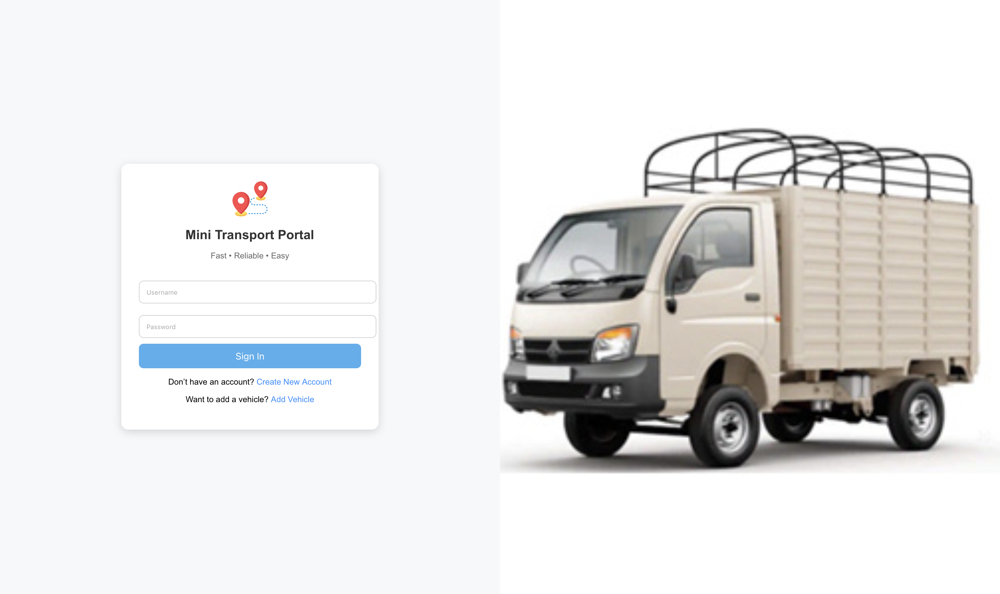
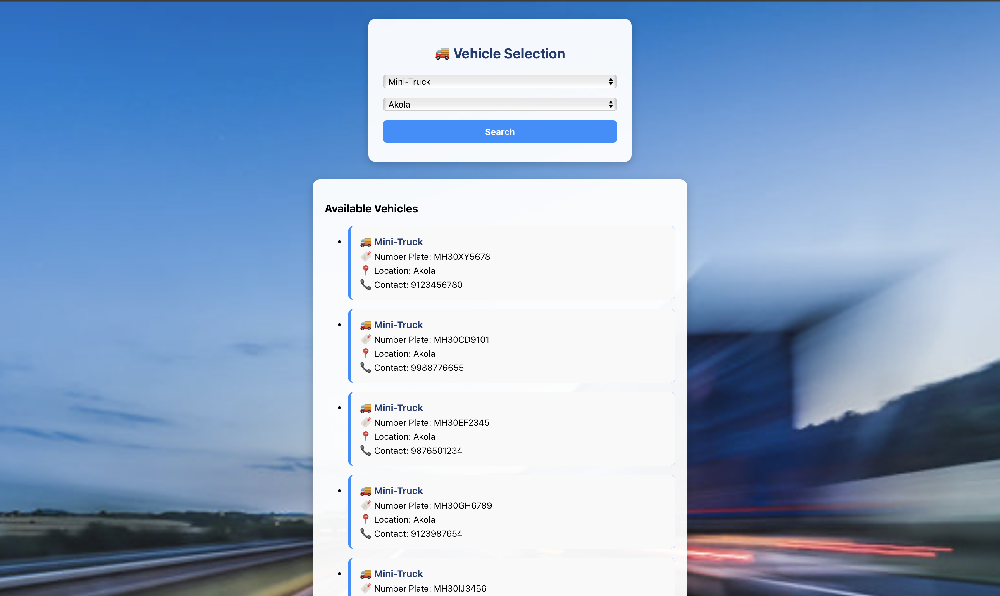
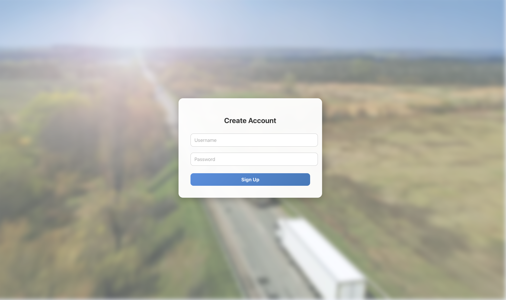
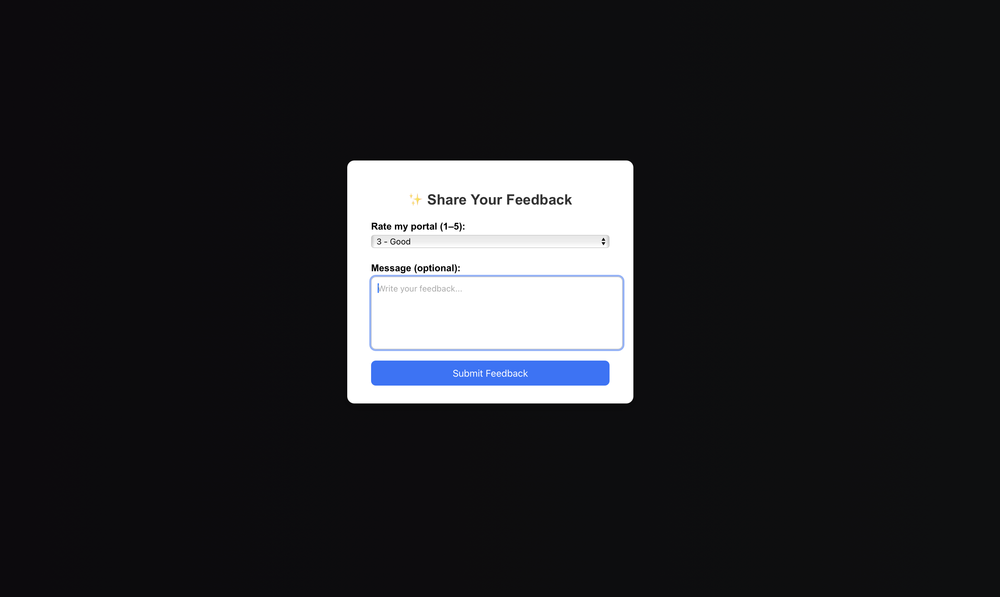

🚛 Mini Transport Portal
A smart transport portal built with React, Spring Boot & MySQL for vehicle management, user authentication, and a feedback system.

✨ Overview
The Mini Transport Portal allows customers to:
Create an account
Log in securely
Search vehicles by type & location
Add their own vehicles
Submit feedback (rating + optional message)
This project demonstrates a complete full-stack web application with authentication, data filtering, and CRUD operations.

🚀 Features

✔️ User Login & Registration
✔️ Add Vehicle (type, number plate, location, contact number)
✔️ Search Vehicles (filtered by type & location)
✔️ Display Vehicle List with details
✔️ Submit Feedback (rating + comment)
✔️ MySQL data persistence
✔️ Modern UI with React + CSS
✔️ Secure backend built with Spring Boot

🛠️ Tech Stack
Frontend :- React,HTML,CSS,JavaScript

Backend :- Java,Spring Boot,Maven,Database,

Database :- MySQL

📂 Project Structure
~/Downloads/mini-transport-portal
│
├── frontend/               # React Application (UI)
│   ├── public/
│   ├── src/
│   ├── package.json
│
├── backend/                # Spring Boot Backend API
│   ├── src/main/java/
│   ├── src/main/resources/
│   ├── pom.xml
│
└── README.md

⚙️ Backend Setup (Spring Boot)
1️⃣ Navigate to backend folder :- cd backend
2️⃣ Run the backend :- ./mvnw spring-boot:run
3️⃣ Backend URL :- http://localhost:8080

💻 Frontend Setup (React)
1️⃣ Navigate to frontend folder :- cd frontend
2️⃣ Install dependencies :- npm install
3️⃣ Start the React app :- npm start
4️⃣ Frontend URL :- http://localhost:3000

🗄️ Database Schema (MySQL)

📌 users Table
| Field    | Type         |
| -------- | ------------ |
| name     | VARCHAR(50)  |
| password | VARCHAR(100) |

📌 vehicles Table
| Field        | Type        |
| ------------ | ----------- |
| type         | VARCHAR(50) |
| number_plate | VARCHAR(20) |
| location     | VARCHAR(50) |
| mobile       | VARCHAR(15) |

📌 feedback Table
| Field   | Type      |
| ------- | --------- |
| rating  | INT (1–5) |
| comment | TEXT      |

🔗 API Endpoints
| Method | Endpoint          | Description                      |
| ------ | ----------------- | -------------------------------- |
| POST   | `/vehicle/add`    | Add new vehicle                  |
| GET    | `/vehicle/search` | Search vehicles by type/location |

Vehicle APIs
| Method | Endpoint          | Description                      |
| ------ | ----------------- | -------------------------------- |
| POST   | `/vehicle/add`    | Add new vehicle                  |
| GET    | `/vehicle/search` | Search vehicles by type/location |

Feedback APIs
| Method | Endpoint        | Description     |
| ------ | --------------- | --------------- |
| POST   | `/feedback/add` | Submit feedback |

🖼️ Screenshots
### 🔹 Login Page

### 🔹 Vehicle Selection

### 🔹 Create Account

### 🔹 Add Vehicle

### 🔹 Feedback Page

